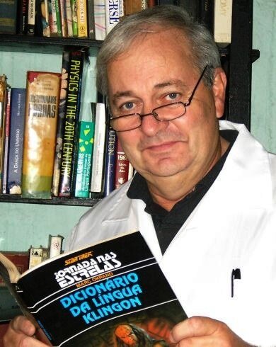
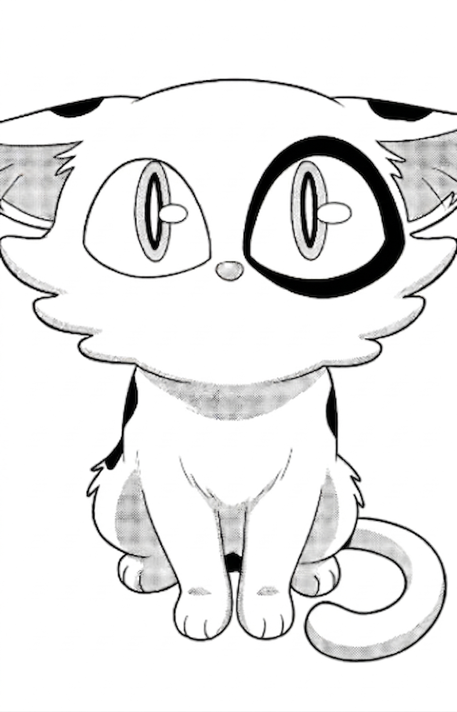
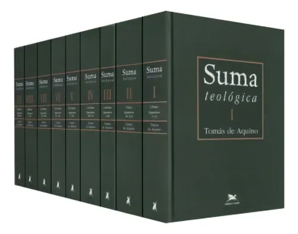
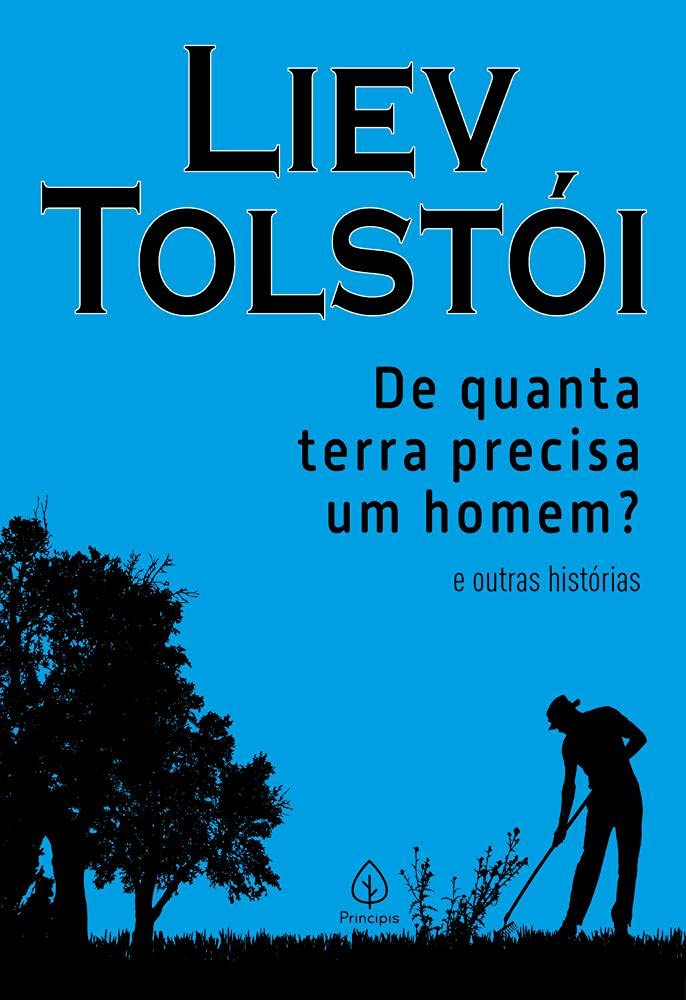
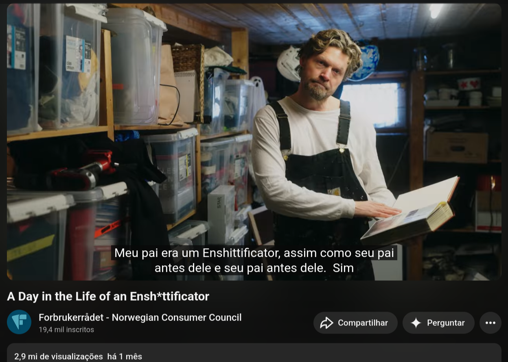
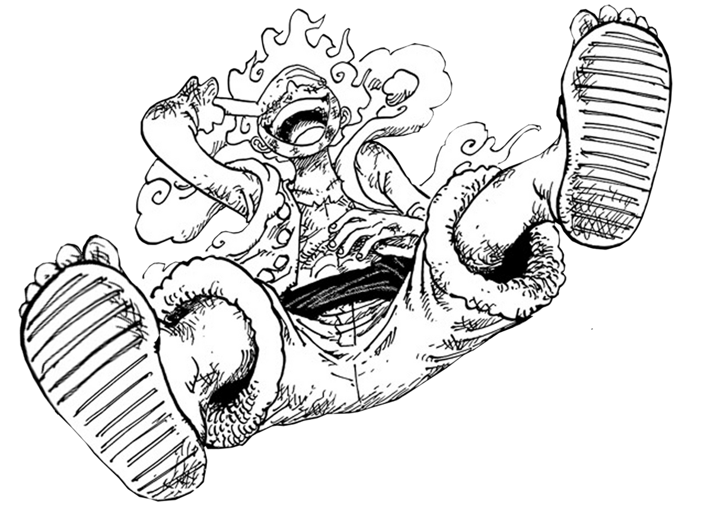
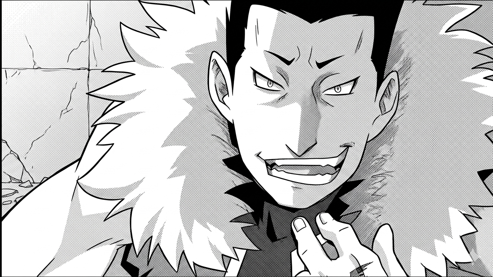

<!--
_color: Black
-->

# O clube do bolinha é a fortaleza da solidão...
---
## Cronograma de Aulas:
| Data | Conteúdo |
|-----------|-----------|
| **13/04/2026** | **A Jornada do Sistema Operacional e a Filosofia Livre** |
| - | História e Fundamentos |
| - | Filosofia Open Source |
| - | Filosofia Free Software |
| - | O Conceito GNU/Linux |
| - | Distribuição Linux |

---
| Data | Conteúdo |
|-----------|-----------|
| **14/04/2026** | **Instalação e Preparação do Ambiente** |
| - | Estrutura de pastas do Linux |
| - | Nomenclatura de Dispositivos |
| - | Máquinas Virtuais |
| - |  Instalação Prática |

---

| Data | Conteúdo |
|-----------|-----------|
| **15/04/2026** | **Terminal, Gerenciamento de Arquivos e Pacotes** |
| - | Shell Básico |
| - | Pipe, Fluxão Padrão de I/O (stdin, stdout, stder) |
| - | Redirecionamento e Path |
| - |  Gerenciamento de Arquivo |
| - |  Gerenciamento de pacotes |

---

| Data | Conteúdo |
|-----------|-----------|
| **22/04/2026** | **Gerenciamento, Administração e Init Systems** |
| - | Sistemas de Arquivos (ext4 e BTRFS) |
| - | Systemd e systemd-free (runit) |
| - | Gerenciamento de Processos |
| - | Permissões (chmod e chwon) |

---
| Data | Conteúdo |
|-----------|-----------|
| **23/04/2026** | **Redes e Interfaces Gráficas** |
| - | Gerenciamento de Rede |
| - | Interfaces Gráficas (DE) |
| - | Compositor (XORG e WAYLAND) |
| - | Windows Manager (i3, SWAY, River, niro) |

---
## Aula dada, aula estudada...

---
## Nana, o companheiro!
- Responsável em passar as atividades do curso. 
- Caraterísticas: carismático, meigo e bastante observador.

___
### Reflexão: a origem todos dos males - a avareza (questão 84, artigo I)

- **A origem dos males:** A avareza como "nutriente" para os outros pecados.

- **O conceito na Suma Teológica:** O apetite imoderado pela riqueza.

- **A diferença vital:** A riqueza em si não é o mal; o problema é a cegueira do exagero

---
## Um exemplo trágico: De quanta terra precisa um homem?

O Custo Real: A Perda da Liberdade
- A busca desenfreada por bens materiais exige um sacrifício.

- Perde-se a própria liberdade e suprime-se a liberdade alheia.

- Prioridade do bem individual em detrimento do bem comum.

- O ciclo repetitivo

---

---
## Você possui o controle!
Nada é mais fundamental do que a liberdade.

---
É isso...
Próximo slide.

