<!--
_color: Black
-->

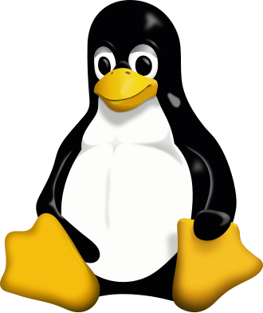

# A Jornada do Sistema Operacional e a Filosofia Livre

---
**Sumário**
- História e Fundamentos
- Filosofia Open Source
- Filosofia Free Software
- O conceito GNU/LINUX
- Distribuição Linux

---
## História e Fundamentos

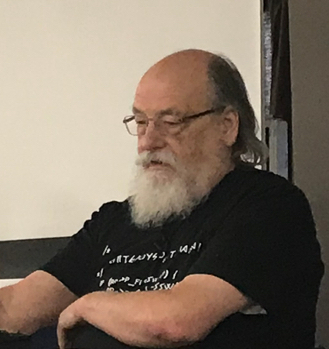
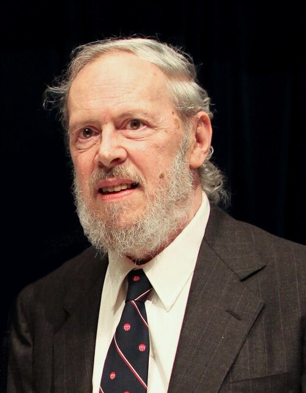

- **1969:** Unix criado no Bell Labs (Ken Thompson, Dennis Ritchie)
- **1973:** Reescrito em C (portável e revolucionário)
- **1970s:** Licenciado para universidades (variantes BSD)

---
## Filosofia Unix

"Escreva programas que façam apenas uma coisa e a façam bem", Doug McIlroy

**Principais regras (são 17 regras ao todo):**
- Modularidade: partes simples com interfaces limpas
- Clareza: código legível é melhor que complexo
- Composição: programas conectados entre si
- Simplicidade: apenas complexidade necessária
- Silêncio: programa não reclama se tudo está bem

---
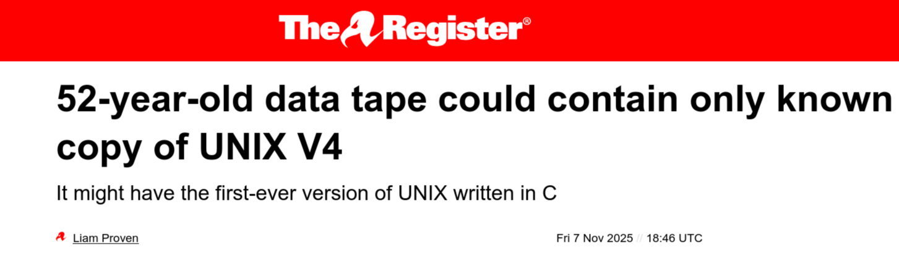

---

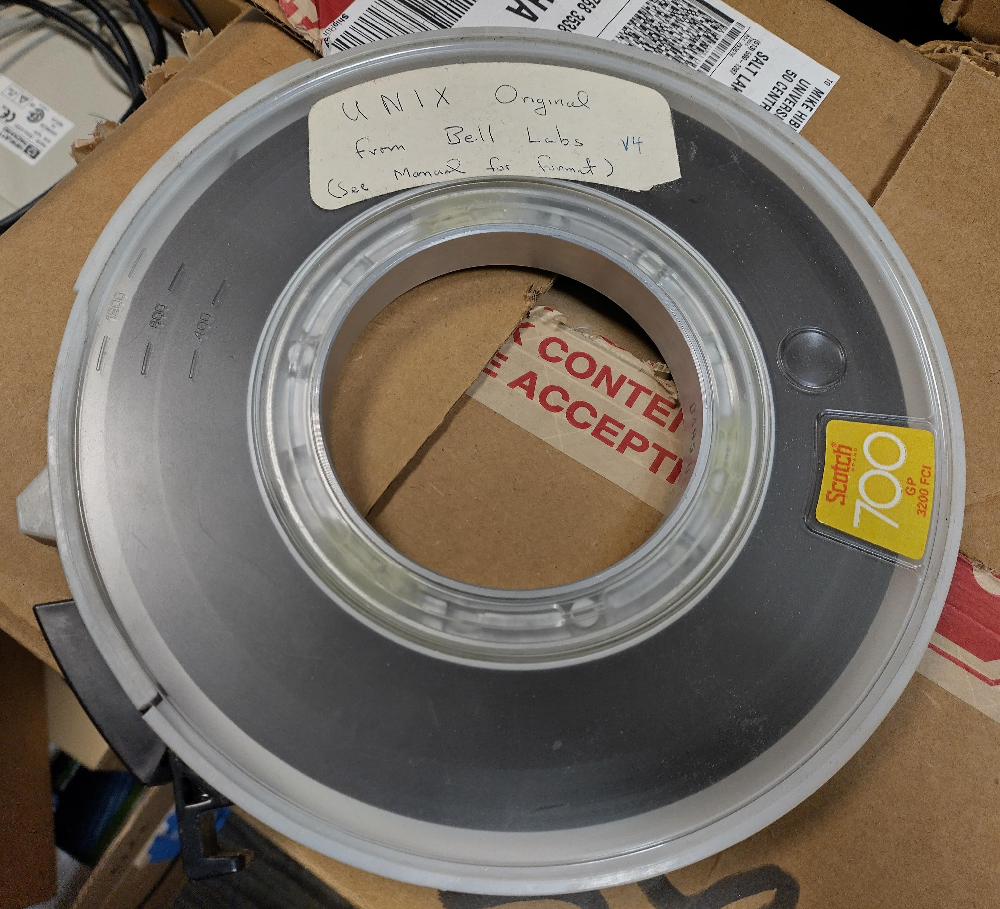

---

## Projeto GNU (GNU is Not Unix)

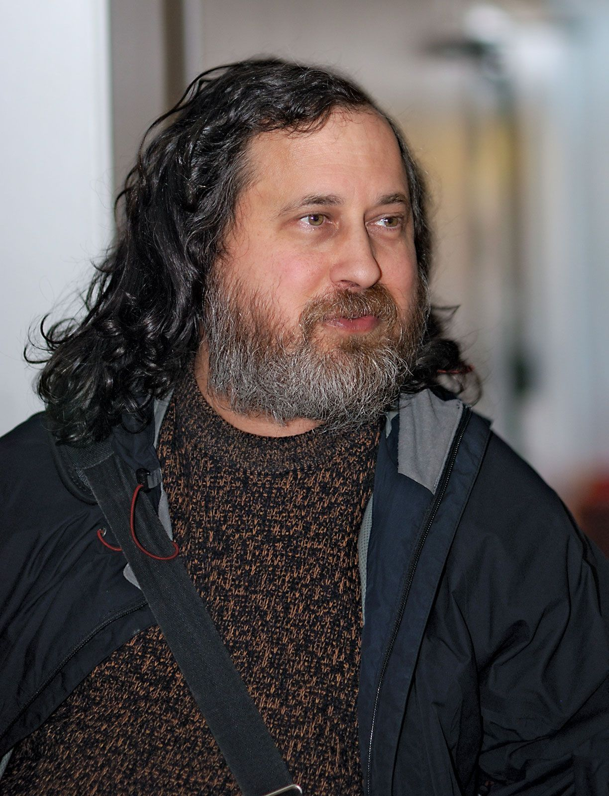

- **1983:** Richard Stallman cria o GNU
- Objetivo: S.O. livre e compatível com Unix
- Unix original era caro (US$ 20.000) e restritivo

---
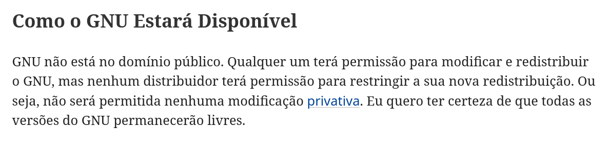

---
## Kernel Linux

- **1991:** Linus Torvalds desenvolve o kernel Linux
- Inspirado no MINIX
- **1992:** Licenciado sob GNU GPL (software livre)
- Possibilitou a união com GNU → **GNU/Linux**

---

## Filosofia Open Source

Código acessível: qualquer pessoa pode ver, modificar e distribuir.

**Princípios:** 
- Revisão por pares
- transparência
- confiabilidade
- flexibilidade
- colaboração.

---
## Filosofia Free Software

Software que respeita a liberdade e comunidade dos usuários.

**As 4 Liberdades Essenciais:**
1. Executar para qualquer propósito
2. Estudar e adaptar às suas necessidades
3. Redistribuir cópias
4. Distribuir versões modificadas

---
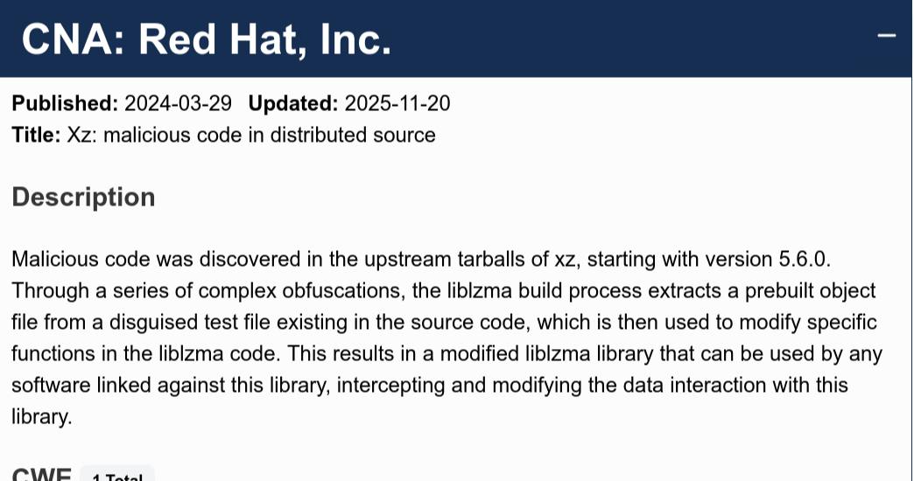

---
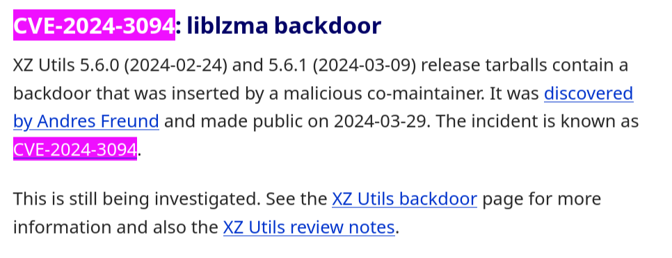

---
## GNU/Linux
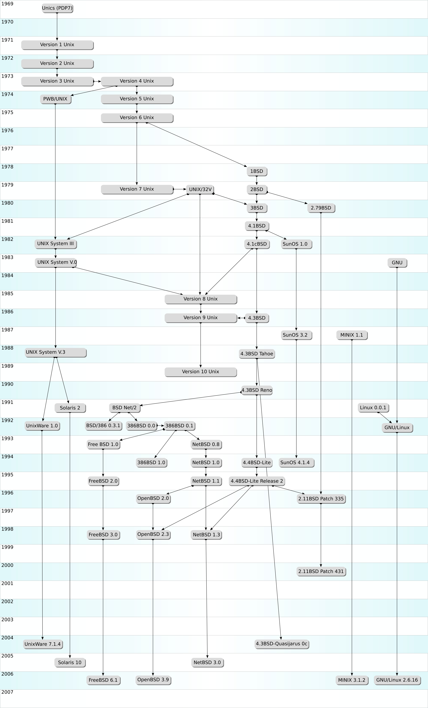

Ao juntar os utilitários, bibliotecas e a interface em modo texto (shell) do projeto GNU com o kernel Linux que gerencia a máquina, obteve-se o sistema operacional plenamente funcional conhecido como GNU/Linux

---
## Distribuição Linux

Distro = Kernel Linux + GNU utilities + gerenciador de pacotes

**Distros bases mais antigas:**
- Slackware (1993)
- Debian (1993) → base para Ubuntu, Linux Mint

---

## Comandos úteis

| Comando | Descrição |
|-----------|-----------|
| `uname` | Exibe informações do Kernel e sistema operacional |
| `cat /etc/os-release` | Para verificar qual distribuição está rodando e sua base |

---
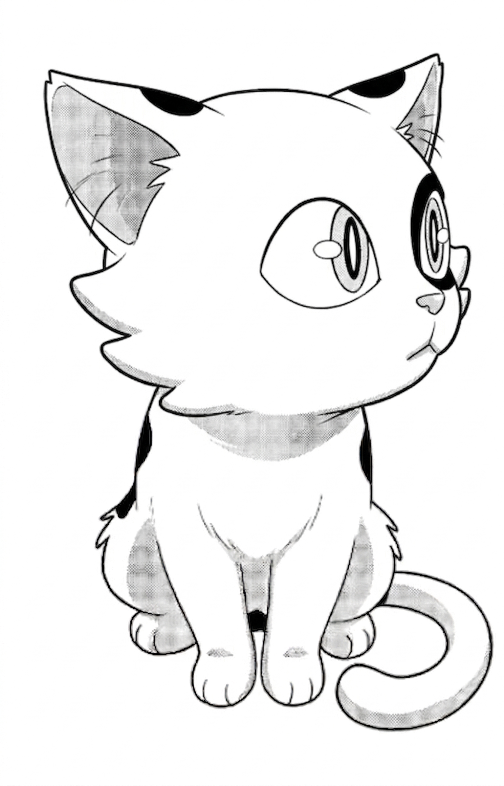

**Tarefa: Identifique a linhagem da sua distribuição**
   - Execute `uname -a` e `cat /etc/os-release`.

   - Identifique: kernel, distribuição, versão, arquitetura.

   - Pesquise qual distribuição está usando e sua base (Debian, RHEL, Arch, etc).

   - Crie um script simples que liste essas informações.

   - Crie um pequeno relatório em texto puro listando três ferramentas do Projeto GNU.

---
## Referencias
- [Volnys & Midorikawa (c) 1
Introdução ao Sistema UNIX](https://www.lsi.usp.br/~volnys/courses/linux/pdf-col/unix-col.pdf)
- [History of Unix](https://en.wikipedia.org/wiki/History_of_Unix) 
- [Uma breve história do UNIX, LINUX e Software Livre](https://wiki.inf.ufpr.br/maziero/doku.php?id=unix:historico_do_unix_e_linux)
- [Contrato Social Debian](https://www.debian.org/social_contract.pt.html)
- [O que é o software livre?](https://www.gnu.org/philosophy/free-sw.pt-br.html)
- [A filosofia Unix](https://www.tabnews.com.br/rafael/a-filosofia-unix)
- [The Art of Unix Programming](http://www.catb.org/esr/writings/taoup/html/)
- [Guia Pratico do servidor Linux ](https://www.casadocodigo.com.br/products/livro-admin-linux)
- [What is open source?](https://www.redhat.com/en/topics/open-source/what-is-open-source)
- [Commit da remoção do Backdoor | XZ](https://codeberg.org/tukaani/xz/commit/e93e13c8b3bec925c56e0c0b675d8000a0f7f754)

---
<!-- _paginate: skip -->

