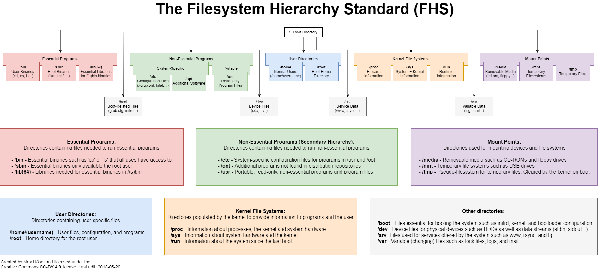
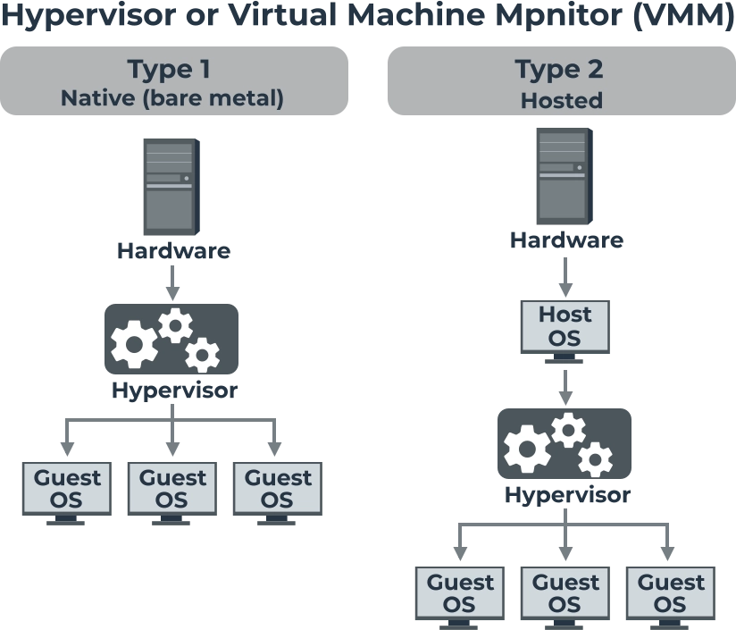

<!--
_color: Black
-->

# Instalação e Preparação do Ambiente

---
**Sumário**
- Estrutura de pastas do Linux
- Nomenclatura de Dispositivos
- Máquinas Virtuais
- Instalação Prática

---
## Estrutura de pastas
Hierárquica com raiz `/`. Segue FHS (Filesystem Hierarchy Standard).

**Principais:** `/bin` (comandos), `/dev` (dispositivos), `/etc` (config), `/lib` (libs), `/usr` (programas), `/var` (dados), `/tmp` (temp), `/home` (usuários)

---

___
**Home usuário:** 
- Públicas: `Documentos`, `Downloads`, `Imagens`, `Músicas`, `Vídeos`
- Privadas: `.config` (configs), `.cache` (cache), `.local` (dados), `.themes`, `.icons`
- Arquivo oculto começa com `.`

---
## Nomenclatura de Dispositivos
"Tudo é um arquivo" - Hardware é abstraído como arquivos em `/dev`:
- `/dev/sda`, `/dev/sdb` = Discos SATA
- `/dev/nvme` = SSD NVMe
- `/dev/null` = Descarta dados
- `/dev/tty` = Terminal virtual

---
## Máquinas Virtuais
Ambiente isolado com CPU, SO, memória, rede e armazenamento abstraídos do hardware real.

**Tipos:**
- **Tipo 1 (Nativo):** Direto no hardware
- **Tipo 2 (Hospedado):** Como aplicativo sobre o SO

**Usaremos:** Gnome Boxes (Tipo 2) 

---
## Instalação Prática
**Gnome Boxes:**
- Flatpak: `flatpak install flathub org.gnome.Boxes`
- APT: `sudo apt install gnome-boxes`
- Pacman: `sudo pacman -S gnome-boxes`

**Distro:** Linux Mint - [Baixe ISO aqui](https://linuxmint.com/download.php)

---
## Comandos úteis

| Comando | Descrição |
|-----------|-----------|
| `lsblk` | Lista dispositivos de bloco |
| `fdisk` | Gerencia/visualiza partições |
| `df` | Espaço livre/ocupado de partições |
| `ls` | Listar conteúdo de pastas |
| `cd` | Navegar entre pastas |
| `fsck` | Verificar/reparar sistemas de arquivo |
---

**Tarefa: Instalar o Linux Mint via Gnome Boxes, simulando uma estrutura de armazenamento mista**
   - Ao criar a VM do Mint, tente identificar durante o particionamento manual como o sistema nomeia os discos virtuais (provavelmente /dev/vda ou /dev/sda).

   - Após a instalação, navegue pelo terminal até `/etc`, `/var/log` e `/mnt`, criando um arquivo vazio em `/tmp` e observando se ele permanece lá após reiniciar a VM.

---
## Referencias
- [About Oracle VirtualBox](https://www.virtualbox.org/manual/UserManual.html)
- [O que é virtualização?](https://www.redhat.com/pt-br/topics/virtualization/what-is-virtualization) 
- [Este é o guia definitivo da pasta /home no Linux](https://diolinux.com.br/tutoriais/guia-da-pasta-home-linux.html)
- [A estrutura de diretórios Linux ](https://www.linuxando.com/tutorial.php?t=A%20estrutura%20de%20diret%C3%B3rios%20Linux_6)
- [Começando com o Linux Comandos, serviços e administração](https://www.casadocodigo.com.br/products/livro-linux)
- [Filesystem Hierarchy Standard](https://refspecs.linuxfoundation.org/fhs.shtml)

---
<!-- _paginate: skip -->

