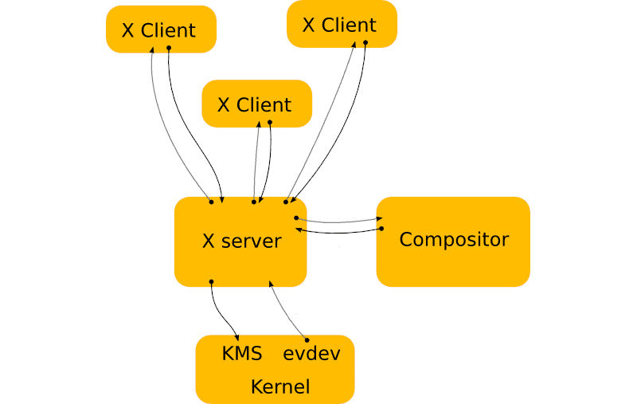
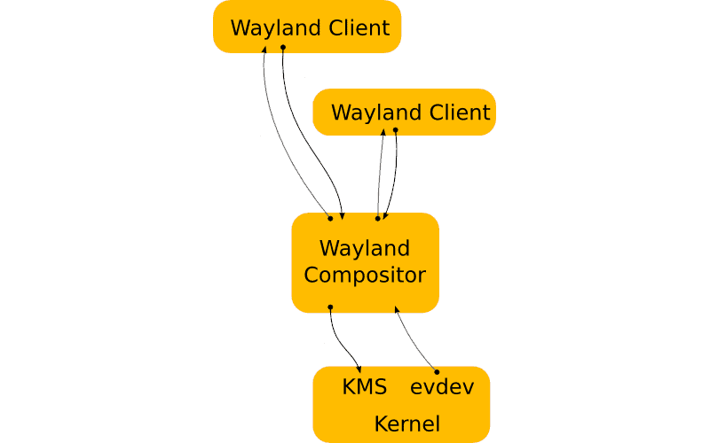

# Redes e Interfaces Gráficas

---
**Sumário**
- Gerenciamento de Rede
- Interfaces Gráficas (DE)
- Compositor (XORG e WAYLAND)
- Windows Manager (i3, SWAY, River, niro)

---
## Gerenciamento de Rede
Configuração de interfaces, endereçamento IP, roteamento e DNS via TCP/IP.

**Interfaces:**
- `eth0`/`enp0s3` - conexões cabeadas (Ethernet)
- `wlan0` - redes sem fio (wireless)
- `lo` - loopback (localhost)

---
**Configuração:**
- **Dinâmica:** Temporária, se perde ao reiniciar
- **Estática:** Permanente, mantém após reboot

**DNS & Hostname:**
- `/etc/resolv.conf` - configurar servidores DNS
- `/etc/hostname` - nome da máquina (estático)
- `hostname <nome>` - altera dinamicamente (sessão)

---
## Interfaces Gráficas (Desktop Environments)
Camada que permite interação visual com o sistema. Linux funciona independente de servidor gráfico.

**Ambientes Populares:**
- **GNOME: minimalista** 
- **KDE (Plasma): customizável** 
- **Xfce: leve**

---
## Compositor
Evolução de X11 (Xorg) para Wayland.

**Xorg (X11):** Servidor X intermediário entre hardware, clientes e compositor.

- Fluxo: Hardware → Kernel → Servidor X → Cliente → Renderização → Servidor X → Compositor → Hardware

- Ineficiente: muita redundância e latência

---
**Wayland:** Compositor é o próprio servidor de exibição.
- Fluxo: Hardware → Kernel → Compositor → Cliente → Buffer compartilhado → Exibição

- Eficiente: entrada direta, mapeamento exato, renderização direta

- Compositor controla todo grafo de cena e transformações visuais

---
## Windows Manager
Software responsável por controlar posicionamento, aparência e comportamento das janelas.

**Tipos:**
- **Stacking (Floating):** Janelas flutuam e se sobrepõem (como Windows/macOS)
- **Tiling:** Organiza lado a lado em "mosaico", sem sobreposição
- **Dynamic:** Alterna dinamicamente entre tiling e flutuante
---
## Comandos úteis

**Rede:**
| Comando | Descrição |
|-----------|-----------|
| `ip` | Configura e exibe interfaces de rede |
| `ping` | Testa conectividade com hosts remotos |
| `nmcli` | Gerencia conexões de rede |

---
**Informação:**
| Comando | Descrição |
|-----------|-----------|
| `uptime` | Exibe tempo de atividade do sistema |
| `pinky` | Exibe informações sobre usuários logados |
---

**Tarefa: Validar a configuração de rede via CLI e identificar o compositor em uso**
- Use ip addr para identificar sua interface de rede e ping -c 4 8.8.8.8 para testar a latência.

- Altere o seu Hostname temporariamente com o comando hostname e verifique a mudança no arquivo /etc/hostname.

---

- Descubra se sua sessão atual roda sobre X11 ou Wayland executando echo $XDG_SESSION_TYPE no terminal.

- Configure em `/etc/NetworkManager/conf.d` DNS globalmente.

---
## Referencias
- [Major Differences between Wayland and Xorg Server](https://infotechys.com/major-differences-between-wayland-and-xorg/)
- [Window manager](https://wiki.archlinux.org/title/Window_manager)
- [A estrutura de diretórios Linux ](https://www.linuxando.com/tutorial.php?t=A%20estrutura%20de%20diret%C3%B3rios%20Linux_6)
- [Começando com o Linux Comandos, serviços e administração](https://www.casadocodigo.com.br/products/livro-linux)
- [Guia Pratico do servidor Linux](https://www.casadocodigo.com.br/products/livro-admin-linux)
- [Wayland Architecture](https://wayland.freedesktop.org/architecture.html)
- [An Introduction to the UNIX Shell](https://www.di.ubi.pt/~crocker/prog3/unix_c_internets/sh.pdf)
- [X.Org Server](https://en.wikipedia.org/wiki/X.Org_Server)

---
<!-- _paginate: skip -->

